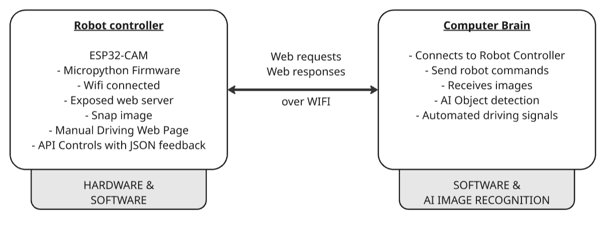

# ESP32-Robot-Ctrl  
  
BROTHERS Hobby project for robotic Lawn Mower.  
The robot lawnmower **is not** autonomous, it requires an external program to implement the driving intelligence and object detection. It can be controlled using a web browser with very simple commands - mostly for testing.  

> **⚠️ Work in Progress:**  
> Micropython firmware for ESP32-CAM inpired by shariltumin's github project->  [esp32-cam-micropython-2022](https://github.com/shariltumin/esp32-cam-micropython-2022)   

---  

#     
# Introduction  
  

This project is divided in two main components.  
- The robot itself with it's own web based controller  
- The Computer Brain that implements high level funtions to control the robot  

See our [Read The Docs Pages](https://about.readthedocs.com/) [Coming soon] for in depth documentation.  

# Technologies
This project is designed to learn. For this purpose we chose to implement most of the programming in [Python](https://www.python.org/) and/or [MicroPython](https://micropython.org/).  

## HARDWARE
- ESP32-S2 micro-controller based on the [espressif](https://www.espressif.com/en/products/socs/esp32-s2) hardware with the Camera package  

# Robot controller 

# Computer Brain
